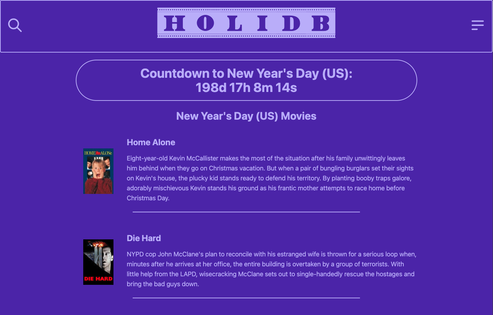

# holiDB
Tag your favorite movies with holidays to make finding a movie to watch easier to think of!

## Description
  *  Use postgres and sequelize to sync a database of movie and holiday data
  *  Call on the moviedb-promise npm package to find movies and tag them with your favorite movies.
  *  Create new holidays to personalize what you want to celebrate. 

## Screenshot

  
  ## Table of Contents
  * [Installation](#installation)
  * [Usage](#usage)
  * [Contributing](#contribution)
  * [Questions](#questions)
  * [Obstacles](#obstacles)
  * [Successes](#successes)

  ## App live at

  * https://holidb.onrender.com/

  ## Installation

  If cloning the code down.

  To install necessary dependencies, run the following command:

  * npm i
  * connect to the postgres server by running psql -U (username here) and the password for your postgres login. 
  * run the schema and seed the data running \i db/schema.sql and in the terminal npm run seed which creates the tables with starter data. 
  
  
  ## Usage
  * A Mac or PC with a terminal. Common examples are Zsh for Mac and Bash for Windows.
  * Once you navigate to the correct integrated terminal run npx nodemon server to start up the server and navigate to your localhost:{PORT#} 

  ## Contributing
  * Create a pull request

  ## License
   

  This project is unlicensed. 

  
  ## Questions
  Any questions about this application should be directed to:

  GitHub: https://github.com/ktunebe

  Email: ktunebe@gmail.com

  ## Tools and 3rd party assistance
  * Josh Naylor EdX bootcamp instructor 
  * moviedb-promise npm package
    - GitHub: https://github.com/grantholle/moviedb-promise
  * ChatGPT, googledocs, color-hex.com
  * TailwindCSS
  * Daisy UI framework
  * Credit to TMDB for the API: [TMDB ](https://www.themoviedb.org/)
    - This product uses the TMDB API but is not endorsed or certified by TMDB.
  * Font for HoliDB logo is "Undeveloped", created by Vladimir Nikolic. Freeware downloaded from [1001fonts.com](https://www.1001fonts.com/)

  ## Obstacles 
  * First time brainstorming our own Models and Associations following the MVC model.
  * Major obstacles refactoring the models, associations, and seed scripts
  * Getting the function to work that calls the moviedb-promise and rendering to the page
  * Working on views before all routes were created. So not being able to see real time front end updates.

  ## Successes
  * Developing a clear idea for the project, quickly making models, associations, and seed data before ultimately refactoring. 
  * Making use of moviedb-promise npm package and the TMDB API call to get a functional app working. 
  * Frontend decisions such as color, themes, fonts quickly decided on. 
  * Developing dynamic buttons that heavily change the functionality/display of the page. 

  ## App Link
 
  * https://holidb.onrender.com/

  

